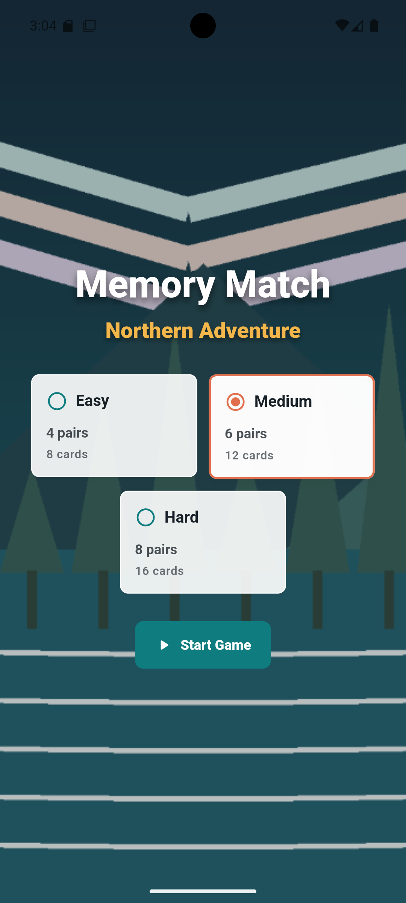
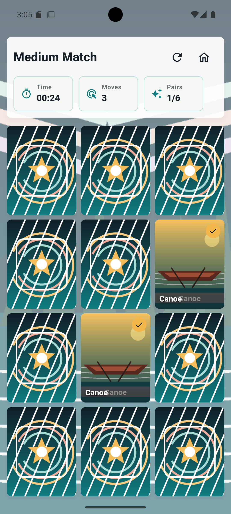
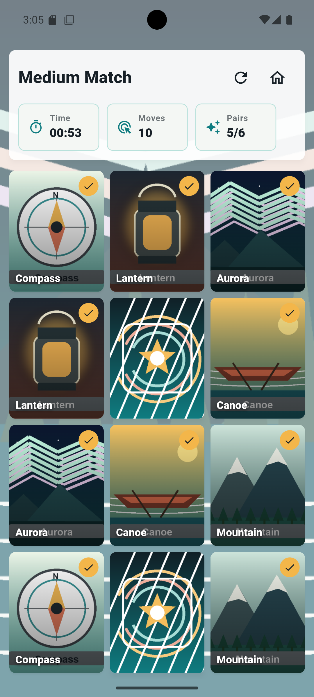
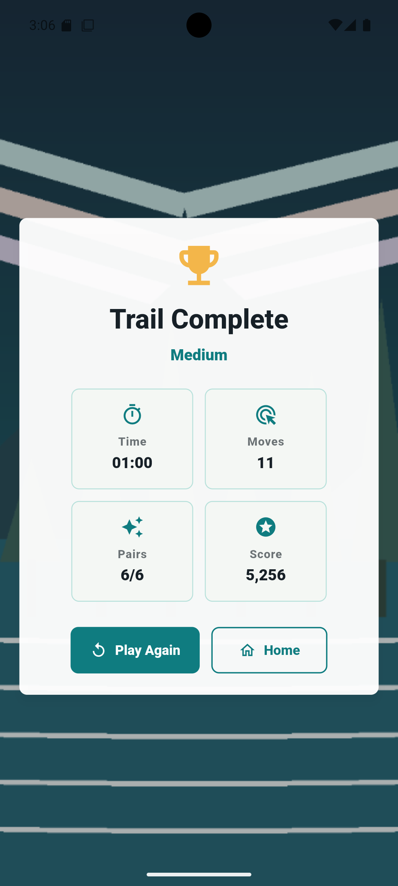

# Memory Matching Flutter Game

**Student:** Luqman Aadil  
**Course:** CS5450 Mobile Programming  
**Instructor:** Dr. Sabah Mohammed  
**Exercise:** Exercise 2 - Memory Matching Flutter Game  
**Repository:** <https://github.com/luqi101/Mobile_Programming_Exercise_2.git>

## Project Overview

Memory Match is a polished Flutter/Dart memory matching game built for CS5450 Exercise 2. The app uses original local image assets, a responsive Material 3 interface, difficulty selection, timed gameplay, move tracking, matched-pair tracking, restart/new-game actions, and a final result screen with score calculation.

The project is structured as a full Flutter/Android Studio project with Android, iOS, and Web platform folders preserved.

## Key Features

- Home screen with local background art and difficulty selection.
- Easy, Medium, and Hard game modes.
- Responsive memory-card grid for phone, tablet, and Chrome/Web layouts.
- Tap-to-flip card interaction with animated card reveal.
- Two-card comparison logic with input locking during mismatch delay.
- Matched pairs stay visible and marked.
- Mismatched pairs flip back automatically.
- Timer, move counter, and matched-pair counter.
- Restart and return-home controls.
- Win/result screen showing difficulty, time, moves, pairs, and score.
- Original local PNG card/background assets generated for this project.
- Unit and widget tests for game logic and core UI flow.

## Game Rules

1. Select a difficulty level and start the game.
2. All cards begin face down.
3. Tap one card to reveal it, then tap a second card.
4. If the two revealed cards match, they remain visible and count as a matched pair.
5. If they do not match, the cards flip back after a short delay.
6. Extra taps are ignored while mismatched cards are waiting to flip back.
7. The game ends when all pairs are matched.
8. The result screen displays the completed time, moves, pairs, and score.

## Difficulty Levels

| Difficulty | Pairs | Cards |
| --- | ---: | ---: |
| Easy | 4 | 8 |
| Medium | 6 | 12 |
| Hard | 8 | 16 |

## Score, Timer, And Moves

- The timer starts when a new game starts and stops when all pairs are matched.
- The move counter increments once for each two-card attempt.
- The matched-pair counter shows progress as `matched/total`.
- The score is calculated from difficulty, elapsed time, and moves. Faster games with fewer moves receive higher scores.

## Design And Responsiveness

The app uses a restrained Material 3 design with a northern/adventure art theme. The interface uses `SafeArea`, `LayoutBuilder`, constrained widths, wrapping controls, and responsive grid column counts to avoid overflow on small phones, tablets, and web viewports.

## Technology Stack

- Flutter 3.44.0
- Dart 3.12.0
- Material 3 widgets
- Flutter `ChangeNotifier` controller for game state
- Local PNG assets
- Flutter unit and widget tests
- Python/Pillow for asset generation
- Python/ReportLab for PDF generation

## Exact Project Structure

Generated build/cache folders are excluded from this listing: `build/`, `.dart_tool/`, `.git/`, `.idea/`, `.gradle/`, `android/.gradle/`, and temporary OS files.

```text
.
|-- .gitignore
|-- .metadata
|-- AGENTS.md
|-- README.md
|-- README.pdf
|-- analysis_options.yaml
|-- android/
|   |-- app/build.gradle.kts
|   |-- app/src/debug/AndroidManifest.xml
|   |-- app/src/main/AndroidManifest.xml
|   |-- app/src/main/kotlin/com/luqmanaadil/memory_matching_flutter_game/MainActivity.kt
|   |-- app/src/main/res/
|   |-- app/src/profile/AndroidManifest.xml
|   |-- build.gradle.kts
|   |-- gradle.properties
|   |-- gradle/wrapper/
|   |-- gradlew
|   |-- gradlew.bat
|   `-- settings.gradle.kts
|-- assets/
|   `-- images/
|       |-- backgrounds/
|       |   |-- game_background.png
|       |   `-- home_background.png
|       `-- cards/
|           |-- card_aurora.png
|           |-- card_back.png
|           |-- card_canoe.png
|           |-- card_compass.png
|           |-- card_lake.png
|           |-- card_lantern.png
|           |-- card_mountain.png
|           |-- card_pine.png
|           `-- card_star.png
|-- ios/
|   |-- Flutter/
|   |-- Runner/
|   |-- Runner.xcodeproj/
|   |-- Runner.xcworkspace/
|   `-- RunnerTests/
|-- lib/
|   |-- app/
|   |   |-- app_theme.dart
|   |   `-- memory_match_app.dart
|   |-- controllers/game_controller.dart
|   |-- main.dart
|   |-- models/
|   |   |-- difficulty.dart
|   |   |-- game_result.dart
|   |   `-- memory_card.dart
|   |-- screens/
|   |   |-- game_screen.dart
|   |   |-- home_screen.dart
|   |   `-- result_screen.dart
|   |-- utils/
|   |   |-- formatters.dart
|   |   `-- scoring.dart
|   `-- widgets/
|       |-- asset_background.dart
|       |-- difficulty_selector.dart
|       |-- game_header.dart
|       |-- memory_card_tile.dart
|       |-- primary_action_button.dart
|       `-- responsive_game_grid.dart
|-- pubspec.lock
|-- pubspec.yaml
|-- screenshots/
|   |-- Screenshot_20260520_030511.png
|   |-- Screenshot_20260520_030550.png
|   |-- Screenshot_20260520_030619.png
|   `-- Screenshot_20260520_030629.png
|-- test/
|   |-- game_controller_test.dart
|   `-- widget_test.dart
|-- tools/
|   |-- build_readme_pdf.py
|   `-- generate_assets.py
`-- web/
    |-- favicon.png
    |-- icons/
    |-- index.html
    `-- manifest.json
```

## Setup Requirements

- Flutter SDK installed and available on `PATH`
- Dart SDK, included with Flutter
- Android Studio with Android SDK and an emulator or physical Android device
- Chrome for web testing
- Python 3 for documentation and asset helper scripts

## Configure The Project

```bash
flutter pub get
python3 tools/generate_assets.py
```

The app uses local assets registered in `pubspec.yaml`:

```yaml
flutter:
  uses-material-design: true
  assets:
    - assets/images/cards/
    - assets/images/backgrounds/
```

## Run On Android

Start an Android emulator or connect a physical Android device, then run:

```bash
flutter devices
flutter run -d <android-device-id>
```

Example when the emulator id is `emulator-5554`:

```bash
flutter run -d emulator-5554
```

For stable testing, an Android API 35 or API 36 emulator is recommended.

## Run On Chrome/Web

```bash
flutter run -d chrome
```

## Run Tests And Static Analysis

```bash
dart format .
flutter analyze
flutter test
```

## Screenshots

| Home Screen | Active Game |
| --- | --- |
|  |  |

| Game Progress | Result Screen |
| --- | --- |
|  |  |
